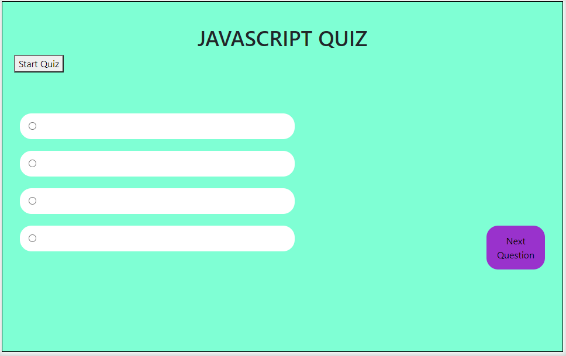
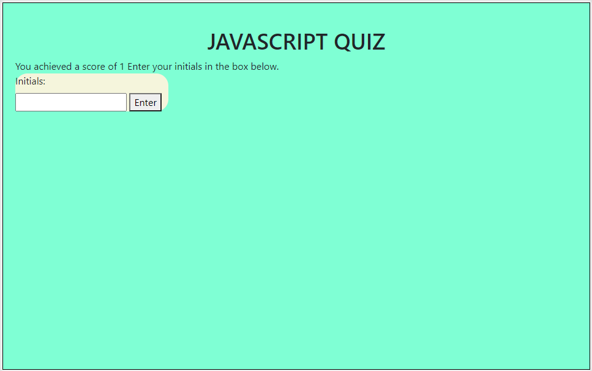
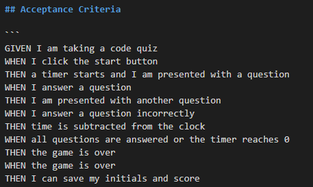

# Javascript Quiz

This program consists of a simple quiz about Javascript concepts. Click the "Start Quiz" button to begin and proceed. Once you are finished with the quiz, you will be prompted for your initials. 

The program will then save your initials and score and then display all recorded scores in a bulleted list.

## Parameters

The following screenshot informs you of the tasks I needed to accomplish.

While the quiz may not be perfect, I hope you enjoy testing it out!

[JavascriptQuiz] (https://admjeffery.github.io/Javascript_Quiz/?)